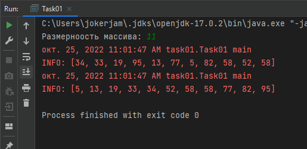
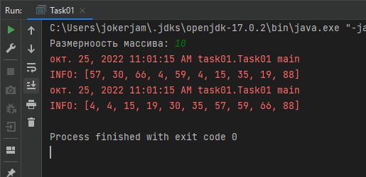
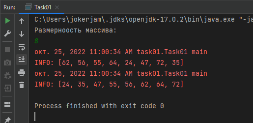
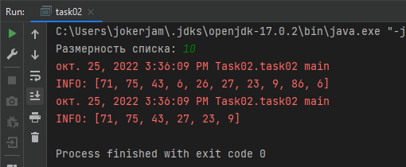

# Коллекции JAVA: Введение

> Для вывода необходимо использовать логгер(Java.Util.Logging)

## Задача 1
Реализовать алгоритм сортировки слиянием.

**Скриншоты**

---

## Задача 2

Пусть дан произвольный список целых чисел, удалить из него четные числа

---

## Задача 3 

Задан целочисленный список ArrayList. Найти минимальное, максимальное и среднее из этого списка.

**Скриншоты** (выполнение, проверка в Excel)

---